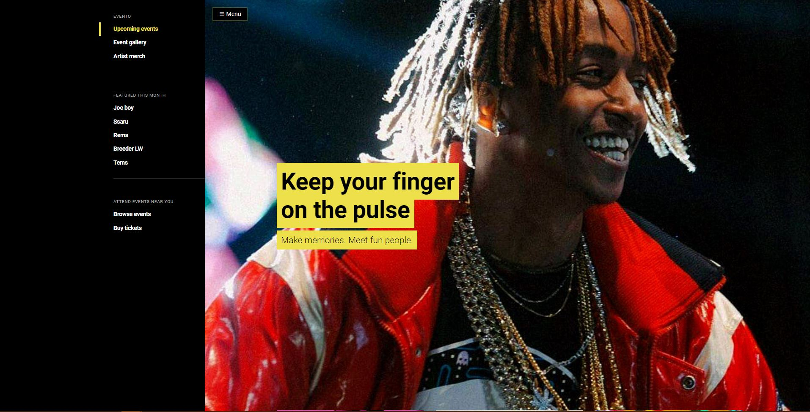

## Evento 

Site for online events booking.

### Clone the project

> In your terminal run, `git clone git@github.com:iddle254/Evento.git `
> This command won't work if you have not configured your git to work with SSH. If you get an error, `git clone https://github.com/iddle254/Evento.git`

### Install dependencies

> `cd evento ` then `composer install `.

### Run the app

> `php artisan serve`

### Demo

> You can view the live site here ~

## **Docker support**

1. Make sure you have docker installed and running on your computer
2. Run `docker-compose up` ( you may have to run `docker-compose up --build` for the first setup phase)

<!-- ## **Run the tests**

1. Run `npm run test` ( `npm test` should also work)

   > 
   > Coverage is decent but can still be improved.

# Issues

## **Routing issues(react-router-dom)**

### **About Page not working on update of react-router-dom from v4 to v6**

> #### Attempted fix **NO.1**

### Screenshots

- Bank landing page.
  
- Ecommerce
   -->

## License

_I am providing code and resources in this repository to you under an open source license. Because this is my personal repository, the license you receive to my code and resources is from me and not my employer (Facebook)._

    Copyright 2022 Charles Motaroki

    Creative Commons Attribution 4.0 International License (CC BY 4.0)

    http://creativecommons.org/licenses/by/4.0/
